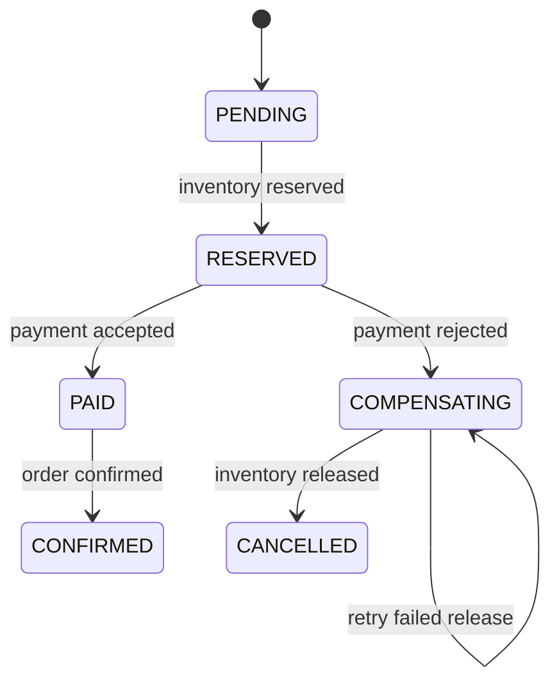

# Capstone — Order Saga, durable inbox, idempotency

Đây là bài tập mở rộng, không phải một distributed system đã được triển khai sẵn.
Code PaymentService/OutboxRelay là nền để tự xây phần tiếp theo.

## Kịch bản

Order service tạo đơn; Inventory giữ hàng; Payment thu tiền; Order xác nhận.
Nếu payment bị từ chối, trả lại hàng. Nếu xác nhận không thể hoàn tất sau thu tiền,
thiết kế quy tắc refund hoặc reconciliation, tránh tự refund khi chỉ mất response tạm thời.

## Các bước thực hiện

1. Thêm bảng saga_order(id, state, version), inbox(event_id PRIMARY KEY, payload_hash),
   outbox có attempts, next_attempt_at, lease_until. Mỗi service dùng local DB riêng khi tách process.
2. Mỗi transition: kiểm tra state/version → ghi state mới + outbox cùng local transaction.
3. Consumer: insert inbox + business effect cùng một transaction. Duplicate event không lặp effect.
4. Cùng idempotency key nhưng payload khác phải bị từ chối; replay cùng payload trả kết quả cũ.
   PaymentService hiện chỉ từ chối id đã dùng, chưa phải API replay đầy đủ.
5. Relay claim một batch nhỏ, gửi ngoài transaction, retry/backoff và acknowledge transaction riêng.
6. Persist compensation pending; không dựa vào catch trong RAM để nhớ việc cần làm sau crash.
7. Viết reconciliation cho timeout mơ hồ: hỏi trạng thái bằng payment id trước khi quyết định retry/refund.

## Acceptance criteria — viết test trước

| Failure injection | Kết quả cần chứng minh |
|---|---|
| Crash trước local commit | Không có business row hoặc outbox row nửa vời |
| Crash sau commit, trước send | Relay restart vẫn tìm thấy pending event |
| Crash sau send, trước ack | Event gửi lại nhưng consumer chỉ áp effect một lần |
| Hai consumer cùng event | Unique inbox + transaction bảo vệ, một effect |
| Payment rejected | Đơn không CONFIRMED; stock cuối cùng được release |
| Release lỗi 2 lần | Compensation còn pending và lần sau thành công |
| Response payment bị mất | Không thu tiền lần hai, truy vấn/replay theo key |
| Hai local DB, DB2 fail | Test thể hiện partial commit; không gọi đó là atomic XA |

## So sánh thiết kế

Với XA/2PC, trình bày participant prepare, durable coordinator decision và recovery sau crash.
Với Saga, trình bày local commit, eventual consistency và compensation.
Với outbox, trình bày durable intent và at-least-once delivery.
Chọn theo yêu cầu consistency, latency và khả năng recovery; không dùng chúng như từ đồng nghĩa.

OutboxRelay hiện dùng Set in-memory làm receiver, chưa có broker/network/lease/durable inbox.
Không suy ra exactly-once across restart từ test dedup trong một process.
